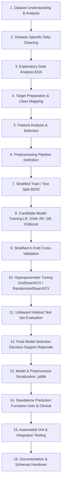

# Member 1 Machine Learning Engineering

## Scope & Responsibility
Member 1 is responsible for the complete end-to-end Machine Learning development for three screening modules:
1. **Heart Disease Risk Screening**
2. **Diabetes Risk Screening**
3. **Stroke Risk Screening**

> [!IMPORTANT]
> **Clinical Disclaimer**: This system is designed and built strictly for **AI-based risk screening, risk stratification, and clinical decision support**. It is **NOT** a medical diagnostic system and cannot replace professional medical judgment, diagnosis, or clinical consultation.

---

## Shared Datasets Location
The original datasets remain centralized in the repository's root dataset directory:
- Heart Disease: `dataset/heart.csv` (Statlog Heart dataset, 270 records, 14 features)
- Diabetes: `dataset/diabetes.csv` (Pima Indians Diabetes dataset, 768 records, 9 features)
- Stroke: `dataset/stroke.csv` (Stroke Prediction dataset, 5,110 records, 12 features)

Original datasets are treated as read-only to preserve integrity across team members.

---

## Standardized ML Lifecycle Workflow

Every disease module follows an identical, reproducible, leak-free ML engineering lifecycle:



---

## Directory Architecture

```
ml/member1/
├── README.md               # Common documentation (this file)
├── config.py               # Shared path resolution, random seeds, and pipeline parameters
├── heart/                  # Heart Disease ML module
│   ├── data/               # Local cache / processed data splits
│   ├── notebooks/          # Exploratory and prototyping notebooks
│   ├── src/                # Modular Python source code
│   ├── models/             # Serialized .joblib models and preprocessors
│   ├── reports/            # Data analysis, cleaning, and EDA reports
│   └── README.md           # Disease-specific documentation
├── diabetes/               # Diabetes ML module
│   ├── data/
│   ├── notebooks/
│   ├── src/
│   ├── models/
│   ├── reports/
│   └── README.md
└── stroke/                 # Stroke ML module
    ├── data/
    ├── notebooks/
    ├── src/
    ├── models/
    ├── reports/
    └── README.md
```

---

## Current Status
- **Phase 0**: Project Inspection & Audit (**Completed**)
- **Phase 1**: ML Project Setup & Structure (**Completed**)
- **Next**: Phase 2 — Dataset Discovery & Formal Analysis
